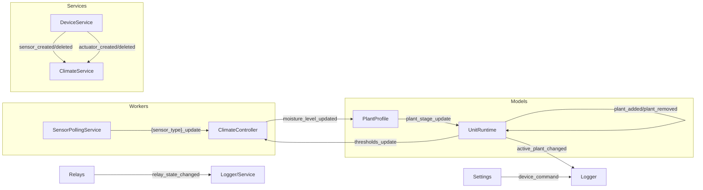

SYSGrow — Event Bus Audit (Updated)

Conventions check
- [x] Topics declared in `app/enums/events.py` (PlantEvent, DeviceEvent, RuntimeEvent)
- [x] Payloads typed via `app/schemas/events.py` for lifecycle, anomalies, calibration, relay state, thresholds, reload
- [x] Wiring during app/worker startup (via service/worker constructors)
- [x] Each key topic has ≥1 publisher and ≥1 subscriber (dynamic sensor updates remain by design)

Topics, Publishers, Subscribers, Gaps
– temperature_update (SensorEvent.TEMPERATURE_UPDATE)
  - Publishers:
    - workers/sensor_polling_service.py (typed SensorUpdatePayload via SensorEvent.for_type)
  - Subscribers:
    - workers/climate_controller.py (via SensorEvent)
    - infrastructure/logging/event_logger.py (via SensorEvent)
  - Schema: SensorUpdatePayload

- humidity_update (SensorEvent.HUMIDITY_UPDATE)
  - Publishers: workers/sensor_polling_service.py (typed)
  - Subscribers: workers/climate_controller.py; infrastructure/logging/event_logger.py
  - Schema: SensorUpdatePayload

- soil_moisture_update (SensorEvent.SOIL_MOISTURE_UPDATE)
  - Publishers: workers/sensor_polling_service.py (typed)
  - Subscribers: workers/climate_controller.py; infrastructure/logging/event_logger.py
  - Schema: SensorUpdatePayload

- co2_update, voc_update (SensorEvent.CO2_UPDATE, SensorEvent.VOC_UPDATE)
  - Publishers: workers/sensor_polling_service.py (typed)
  - Subscribers: workers/climate_controller.py
  - Schema: SensorUpdatePayload

- plant_added, plant_removed (PlantEvent)
  - Publishers: app/models/unit_runtime.py:542 (added), :585 (removed)
  - Subscribers: app/models/unit_runtime.py:452–454
  - Schema: PlantLifecyclePayload
  - Gaps: [x] Closed (typed)

- plant_stage_update (PlantEvent)
  - Publishers: app/models/plant_profile.py:160
  - Subscribers: app/models/unit_runtime.py:454
  - Schema: PlantStageUpdatePayload
  - Gaps: [x] Closed (typed)

- plant_stage_update_{id} (scoped topic)
  - Publishers: app/models/plant_profile.py:101
  - Subscribers: app/models/plant_profile.py:79
  - Schema: None
  - Gaps: [ ] Consider unscoped topic + `plant_id` field, or formal Enum supports formatted topics

– moisture_level_updated (PlantEvent.MOISTURE_LEVEL_UPDATED)
  - Publishers: workers/climate_controller.py; app/models/plant_profile.py
  - Subscribers: app/models/plant_profile.py; infrastructure/logging/event_logger.py
  - Schema: SensorUpdatePayload
  - Gaps: [x] Closed (moved to enum + typed payload)

- thresholds_update (RuntimeEvent.THRESHOLDS_UPDATE)
  - Publishers: app/models/unit_runtime_manager.py:295; app/models/unit_runtime.py:679
  - Subscribers: workers/climate_controller.py:87
  - Schema: ThresholdsUpdatePayload
  - Gaps: [x] Closed

- sensor_reload (RuntimeEvent.SENSOR_RELOAD)
  - Publishers: workers/sensor_polling_service.py (debounced reload trigger)
  - Subscribers: workers/sensor_polling_service.py (handles reload); infrastructure/logging/event_logger.py (logs)
  - Schema: SensorReloadPayload
  - Gaps: [x] Closed (handling wired)

– active_plant_changed (PlantEvent.ACTIVE_PLANT_CHANGED)
  - Publishers: app/models/unit_runtime.py
  - Subscribers: infrastructure/logging/event_logger.py (logs)
  - Schema: PlantLifecyclePayload
  - Gaps: [x] Closed (logging wired; UI may subscribe in future)

– sensor_created, sensor_deleted, actuator_created, actuator_deleted (DeviceEvent)
  - Publishers: app/services/device_service.py
  - Subscribers: (none at runtime; reserved for hardware/infra listeners)
  - Schema: DeviceLifecyclePayload
  - Gaps: [~] Use as integration hooks when additional subscribers are introduced

- relay_state_changed (DeviceEvent.RELAY_STATE_CHANGED)
  - Publishers: infrastructure/hardware/actuators/relays/* (typed RelayStatePayload)
  - Subscribers: infrastructure/logging/event_logger.py (logs); app/services/device_service.py (persists relay changes)
  - Schema: RelayStatePayload
  - Gaps: [~] Persistence optional; hook in DeviceService

- actuator_state_changed (DeviceEvent.ACTUATOR_STATE_CHANGED)
  - Publishers: infrastructure/hardware/actuators/manager.py (after control actions)
  - Subscribers: app/services/device_service.py (persists to ActuatorStateHistory)
  - Schema: ActuatorStatePayload
  - Gaps: [x] Closed

- connectivity_changed (DeviceEvent.CONNECTIVITY_CHANGED)
  - Publishers: infrastructure/hardware/mqtt/mqtt_broker_wrapper.py (on connect/disconnect)
  - Subscribers: infrastructure/logging/event_logger.py (logs); app/services/device_service.py (persists to DeviceConnectivityHistory)
  - Schema: ConnectivityStatePayload
  - Gaps: [x] Closed (base MQTT connectivity)

– device_command (DeviceEvent.DEVICE_COMMAND)
  - Publishers: app/services/settings_service.py; infrastructure/hardware/actuators/manager.py (control actions)
  - Subscribers: infrastructure/logging/event_logger.py (logs)
  - Schema: DeviceCommandPayload
  - Gaps: [x] Closed (typed, multiple publishers)

- MQTT transport topics (external):
  - growtent/+/sensor/+ (subscribe): workers/sensor_polling_service.py:49
  - growtent/reload (subscribe): workers/sensor_polling_service.py:50
  - growtent/sensors/{sensor_type} (publish): infrastructure/hardware/mqtt/mqtt_notifier.py:15
  - growtent/events/{event_type} (publish): infrastructure/hardware/mqtt/mqtt_notifier.py:20
  - zigbee2mqtt/bridge/devices,event (subscribe): infrastructure/hardware/sensors/services/sensor_discovery_service.py:43,46
  - zigbee2mqtt/bridge/request/devices (publish): infrastructure/hardware/sensors/services/sensor_discovery_service.py:129

Compliance Checklist
- [x] Topics come from `app/enums/events.py` (sensor dynamics also publish legacy strings)
- [x] Payloads typed via `app/schemas/events.py` (Pydantic)
- [x] Wiring occurs via services/workers constructors
- [~] No raw string topics in publishers/subscribers (kept by design for dynamic sensor topics)
- [x] Each topic has ≥1 publisher and ≥1 subscriber

Mermaid — Event Wiring (condensed)

Recommendations
- Dynamic topics: keep flexible `{sensor_type}_update` pattern; consider typed wrappers later
- Optional: persist relay state changes via analytics/state tracking if DB API allows

Notes
- Some `.publish(...)` calls span multiple lines; extraction is best-effort and may omit a few topics.
