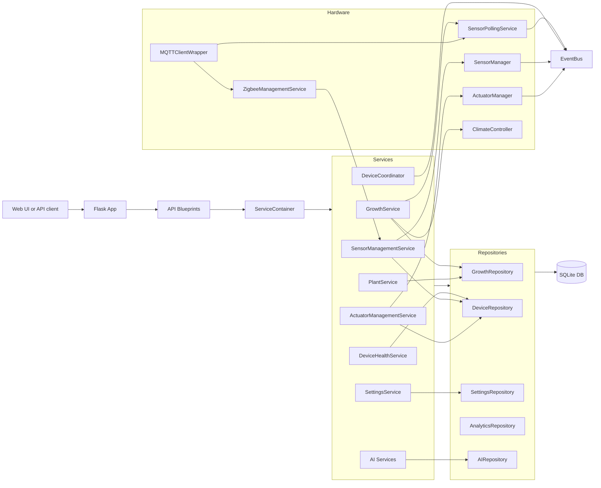

# Application Diagram

```mermaid
flowchart LR
  Client[Web UI or API client]
  Flask[Flask App]
  Blueprints[API Blueprints]
  Container[ServiceContainer]

  subgraph Services
    Growth[GrowthService]
    Plant[PlantService]
    Settings[SettingsService]
    DeviceHealth[DeviceHealthService]
    SensorMgmt[SensorManagementService]
    ActuatorMgmt[ActuatorManagementService]
    DeviceCoord[DeviceCoordinator]
    AI[AI Services]
  end

  subgraph Repositories
    GrowthRepo[GrowthRepository]
    DeviceRepo[DeviceRepository]
    SettingsRepo[SettingsRepository]
    AnalyticsRepo[AnalyticsRepository]
    AIRepo[AIRepository]
  end

  subgraph Hardware
    SensorMgr[SensorManager]
    ActuatorMgr[ActuatorManager]
    Polling[SensorPollingService]
    Climate[ClimateController]
    MQTT[MQTTClientWrapper]
    Zigbee[ZigbeeManagementService]
  end

  DB[(SQLite DB)]
  EventBus[EventBus]

  Client --> Flask --> Blueprints --> Container --> Services
  Services --> Repositories --> DB

  Growth --> GrowthRepo
  Plant --> GrowthRepo
  Settings --> SettingsRepo
  DeviceHealth --> DeviceRepo
  SensorMgmt --> DeviceRepo
  ActuatorMgmt --> DeviceRepo
  AI --> AIRepo

  SensorMgmt --> SensorMgr
  ActuatorMgmt --> ActuatorMgr
  Growth --> Polling
  Growth --> Climate

  Polling --> EventBus
  DeviceCoord --> EventBus
  SensorMgr --> EventBus
  ActuatorMgr --> EventBus

  MQTT --> Polling
  MQTT --> Zigbee
  Zigbee --> SensorMgmt
```
