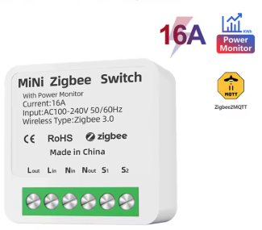
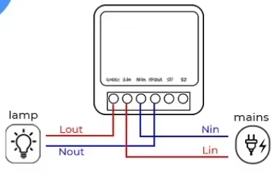

# Actuators

---

## MiNi Zigbee Switch with Power Monitor

> **Purchase link:** [AliExpress](https://www.aliexpress.com/item/1005005408258604.html?spm=a2g0o.productlist.main.35.2722ea07yzHJ4x&algo_pvid=401588dd-faa5-4a5f-b3ff-14a0bc9ccf91&algo_exp_id=401588dd-faa5-4a5f-b3ff-14a0bc9ccf91-34&pdp_ext_f=%7B%22order%22%3A%2221%22%2C%22eval%22%3A%221%22%2C%22fromPage%22%3A%22search%22%7D&pdp_npi=6%40dis%21GBP%2113.84%215.54%21%21%21125.33%2150.13%21%40211b6a7a17632209152421229e4914%2112000032944925620%21sea%21UK%211651047932%21X%211%210%21n_tag%3A-29919%3Bd%3Acd372174%3Bm03_new_user%3A-29895&curPageLogUid=DxCKxsBEQlZY&utparam-url=scene%3Asearch%7Cquery_from%3A%7Cx_object_id%3A1005005408258604%7C_p_origin_prod%3A)



A compact in-wall / DIN-rail Zigbee switch with integrated power monitoring. Used in SYSGrow to control grow lights, irrigation pumps, ventilation fans, and any other mains-powered load up to 16 A.

### Technical Specifications

| Property | Value |
|----------|-------|
| Input Voltage | AC 100–240 V, 50/60 Hz |
| Max. Load Current | 16 A |
| Overload Trip | Auto-off at 17 A |
| Wireless Protocol | Zigbee 3.0 |
| Size | 46 × 46 × 18 mm |
| Shell Material | V0 flame-retardant PC |
| Installation | DIN rail or in-wall box |
| Power-on Behaviour | Default ON / Default OFF / Restore last state (configurable) |
| Energy Monitoring | kWh meter — power, current, voltage statistics |
| Certification | CE / RoHS |

### Wiring



| Terminal | Connection |
|----------|------------|
| **Lin** | Mains Live in |
| **Nin** | Mains Neutral in |
| **Lout** | Load Live out → lamp / pump |
| **Nout** | Load Neutral out → lamp / pump |
| **S1** | Optional external wall switch (momentary) |
| **S2** | Optional second external switch (momentary) |

> ⚠️ **Safety:** Mains voltage wiring must be performed by a qualified electrician. The device auto-disconnects at 17 A overload protection.

### Compatibility


- ✅ Works with any **Zigbee2MQTT** coordinator
- ✅ Supports **Zigbee 3.0** mesh networking
- ❌ Does **not** require a cloud account — fully local

### SYSGrow Integration

Once paired, the switch publishes and accepts messages on:

```
zigbee2mqtt/<friendly_name>
```

SYSGrow maps MQTT keys to actuator channels as follows:

| MQTT Key | Direction | SYSGrow Channel |
|---|---|---|
| `state` | pub / sub | on/off control |
| `power` | publish | watts (real-time) |
| `current` | publish | amps |
| `voltage` | publish | volts |
| `energy` | publish | kWh (cumulative) |

Send `{"state": "ON"}` or `{"state": "OFF"}` to the topic to control the switch remotely.

See [ACTUATOR_API_ENDPOINTS.md](../ACTUATOR_API_ENDPOINTS.md) for the full REST API and [ENERGY_MONITORING_QUICK_REFERENCE.md](../ENERGY_MONITORING_QUICK_REFERENCE.md) for energy analytics.
