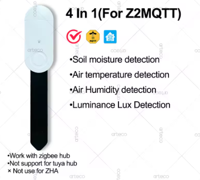

# Sensors

---

## 4-in-1 Soil Sensor (Zigbee)

> **Purchase link:** [AliExpress](https://www.aliexpress.com/item/1005009869701916.html?spm=a2g0o.store_pc_home.0.0.7bcd75017KTs6h)



A compact multi-function sensor that measures four environmental parameters simultaneously — designed to give a complete picture of plant growing conditions from a single device.

### Measurements

| Parameter | Range | Resolution | Accuracy |
|-----------|-------|------------|----------|
| Soil Moisture | 0–100% | 3% | — |
| Air Temperature | — | 0.1 °C | ±0.5 °C |
| Air Humidity | 0–100% | 3% | ±5% |
| Light Intensity | — | 1 lux | — |

### Technical Specifications

| Property | Value |
|----------|-------|
| Wireless Protocol | Zigbee 3.0 |
| Power Supply | 2 × LR03 AAA batteries |
| Working Voltage | DC 3V |
| Standby Current | ≤ 20 µA |

### Compatibility


| Gateway Type | Supported |
|---|---|
| Zigbee hub + **Zigbee2MQTT** | ✅ Yes |
| Tuya hub | ❌ No |
| ZHA (Zigbee Home Automation) | ❌ No |

> **Important:** This sensor **only works with Zigbee2MQTT**. It will not pair with Tuya-based gateways or ZHA. Ensure your coordinator is running Zigbee2MQTT before purchasing.

### SYSGrow Integration

Once the sensor appears in Zigbee2MQTT it publishes readings on the MQTT topic:

```
zigbee2mqtt/<friendly_name>
```

SYSGrow's MQTT device handler picks up the following JSON keys automatically:

| MQTT Key | SYSGrow Channel |
|---|---|
| `soil_moisture` | `soil_moisture` |
| `temperature` | `temperature` |
| `humidity` | `humidity` |
| `illuminance_lux` | `light_intensity` |

See [SENSOR_INTEGRATION_GUIDE.md](../SENSOR_INTEGRATION_GUIDE.md) for full pairing and calibration steps.